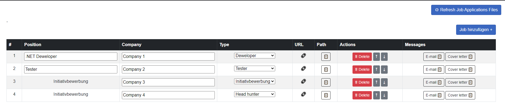

# BewerbungMaster

BewerbungMaster is a Blazor web application designed to efficiently create and manage job applications. 

## Features
- Job application files generation (CVs, cover letters) from JSON data:

- Editing and deleting entries
- Moving entries to the end of the list

## To-Do
- Adding entries manually
- Creating messages to employers

## Key Components and Architecture
### wwwroot Directory
- `JobAppDocs/`: Stores generated job application documents
- `Users/`: Contains user-specific document templates
- `data.json`: Stores job application data in JSON format

### Services
The `Services` directory contains the core business logic of the application:
- `FileManagementService.cs` and `FileManagementServiceStatic.cs`: File operations for job application documents
- `GetJobApplicationServices.cs`: Retrieves job application data
- `GetUserData.cs`: Manages user data retrieval
- `PdfGenerationService.cs`: Generates PDF documents for job applications

#### PdfGenerationService.cs
This service is responsible for generating PDF documents for job applications. It utilizes the iText7 library to create professional-looking PDFs with advanced features:

1. **iText7 Integration**: The service leverages iText7, a powerful PDF manipulation library, to create and modify PDF documents programmatically.

2. **Hyperlink Detection**: The service includes functionality to automatically detect URLs within the text content. When a URL is identified, it's converted into an active hyperlink in the generated PDF, enhancing the interactivity of the document.

3. **Syllable Hyphenation**: To improve the readability and layout of the generated PDFs, the service implements syllable hyphenation. This feature intelligently breaks words at appropriate syllable boundaries when necessary, ensuring a clean and professional appearance of the text, especially in narrow columns or justified text alignments.

4. **Dynamic Content Placement**: The service can dynamically position text, images, and other elements within the PDF, allowing for flexible and customizable document layouts.

5. **Font Management**: It handles various font styles and sizes, enabling rich text formatting in the generated PDFs.

These advanced features of the PdfGenerationService.cs contribute to creating polished, professional-looking job application documents that stand out to potential employers.

## Installation

Currently, only the source code is available. To set up the project:

1. Clone the repository
2. Open the solution in Visual Studio or your preferred IDE
3. Restore NuGet packages
4. Build the project

## Usage

1. Provide job data in the `data.json` file located in the `wwwroot` directory. Include the following information for each job application:
   - Id
   - URL
   - Position
   - Company

The `Crawlers` directory contains sample crawlers for extracting this data written in Python/Selenium.

2. You can create your own documents in the `Users` directory within `wwwroot`. Make sure to indicate this directory in the `appsetings.Development.json` file.

3. Run the application and use the interface to manage your job applications and generate documents.

## Dependencies

This project uses the following main dependencies:

- .NET 8.0
- itext7 (v8.0.5)
- itext7.bouncy-castle-adapter (v8.0.5) - doesn't work without it
- itext7.commons (v8.0.5)
- itext7.hyph (v8.0.5)

For a complete list of dependencies, please refer to the `BewerbungMasterApp.csproj` file.

## License

This project is licensed under the MIT License - see the [LICENSE](LICENSE) file for details.

## Contributing

Contributions are welcome! Please feel free to submit a Pull Request.

## Support

If you encounter any problems or have any questions, please open an issue in the GitHub repository.
